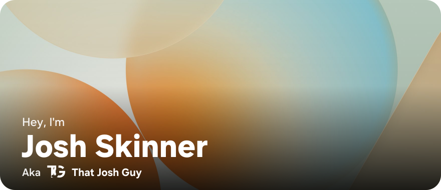
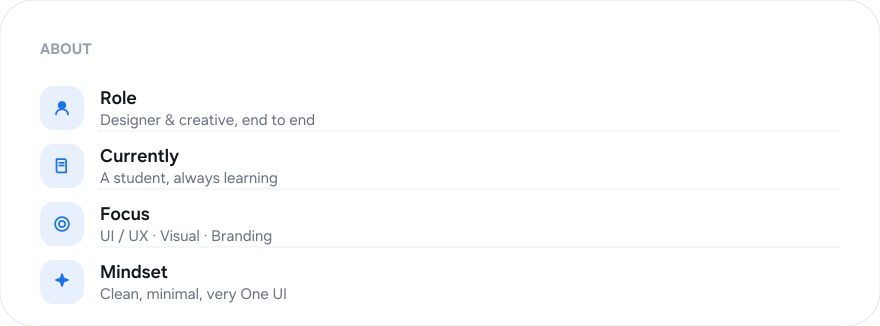
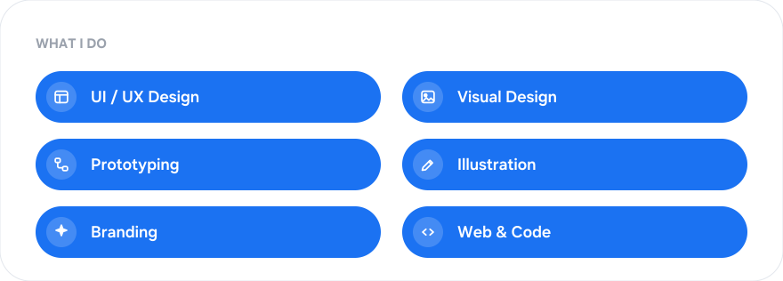

<!-- Profile README · One UI styled · Adaptive light/dark · One UI Sans · One UI icons -->

<!-- ░░░ HERO ░░░ -->
<picture>
  <source media="(prefers-color-scheme: dark)" srcset="hero_dark.svg">
  
</picture>

<!-- ░░░ ROLES ░░░ -->
<picture>
  <source media="(prefers-color-scheme: dark)" srcset="roles_dark.svg">
  
</picture>

  

<!-- ░░░ ABOUT ME ░░░ -->
<picture>
  <source media="(prefers-color-scheme: dark)" srcset="about_dark.svg">
  
</picture>

  

<!-- ░░░ FEATURED IN ░░░ -->
<picture>
  <source media="(prefers-color-scheme: dark)" srcset="featured_dark.svg">
  
</picture>

  

<!-- ░░░ WHAT I DO ░░░ -->
<picture>
  <source media="(prefers-color-scheme: dark)" srcset="skills_dark.svg">
  
</picture>

  

<!-- ░░░ STATS ░░░ -->
<picture>
  <source media="(prefers-color-scheme: dark)" srcset="https://github-readme-stats.vercel.app/api?username=thatjoshguy67&show_icons=true&hide_border=true&border_radius=18&title_color=5A93FF&icon_color=5A93FF&text_color=C9D1D9&bg_color=1A1C20">
  
</picture>
<picture>
  <source media="(prefers-color-scheme: dark)" srcset="https://github-readme-stats.vercel.app/api/top-langs/?username=thatjoshguy67&layout=compact&hide_border=true&border_radius=18&title_color=5A93FF&text_color=C9D1D9&bg_color=1A1C20">
  
</picture>

  

<!-- ░░░ CONNECT ░░░ -->
<a href="https://github.com/thatjoshguy67">
  <picture>
    <source media="(prefers-color-scheme: dark)" srcset="btn_github_dark.svg">
    
  </picture>
</a>
&nbsp;
<a href="https://thatjoshguy.me">
  <picture>
    <source media="(prefers-color-scheme: dark)" srcset="btn_website_dark.svg">
    
  </picture>
</a>
&nbsp;
<a href="https://x.com/thatjoshguy69">
  <picture>
    <source media="(prefers-color-scheme: dark)" srcset="btn_x_dark.svg">
    
  </picture>
</a>
&nbsp;
<a href="mailto:email@thatjoshguy.me">
  <picture>
    <source media="(prefers-color-scheme: dark)" srcset="btn_email_dark.svg">
    
  </picture>
</a>

<!--
  Type: One UI Sans. Icons: One UI (Samsung) icon set. Card text is pre-rendered to
  vector paths inside the SVGs, so everything displays on GitHub without the font.
  Theme switches automatically with GitHub light/dark via <picture>.
-->
